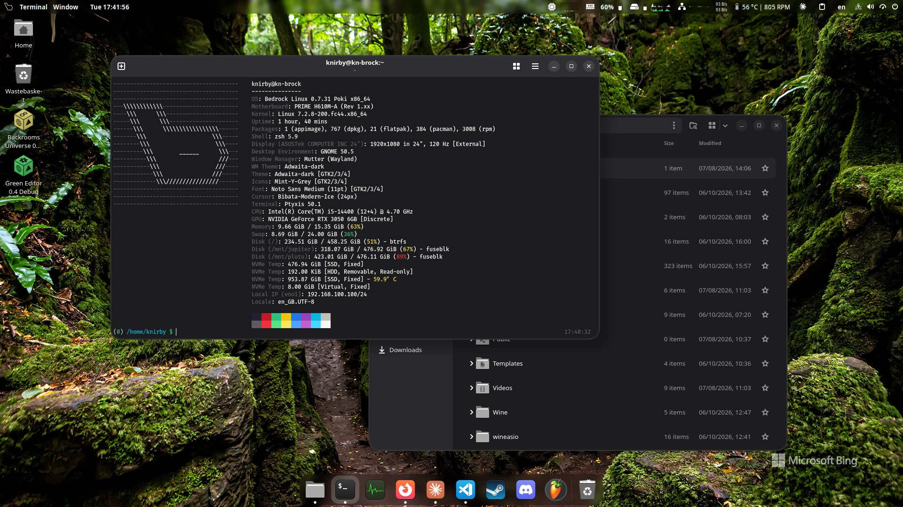
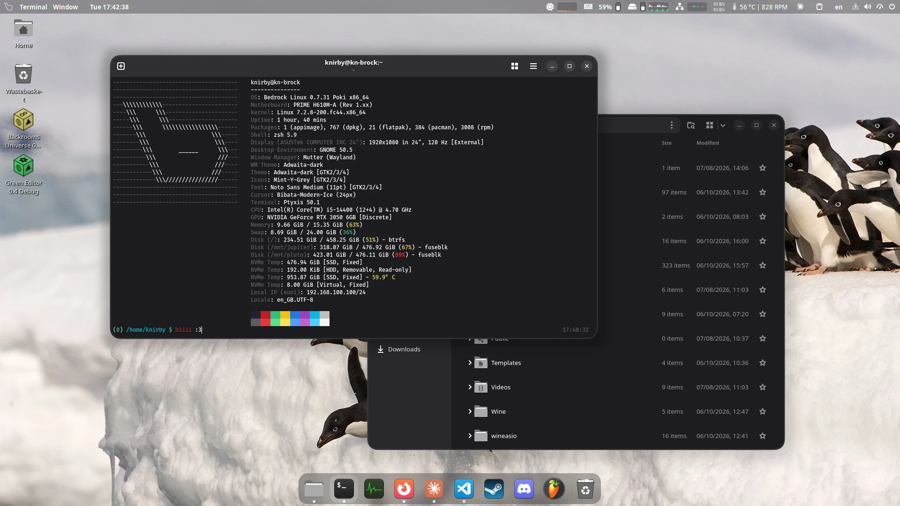

# gnome-dots

knirby's GNOME desktop in one command: dark Adwaita with an accent colour that follows the wallpaper, Mint-Y-Grey icons, the Bibata Modern Ice cursor, frosted blur everywhere, rounded windows, ArcMenu with your distribution's logo, a system monitor in the top bar, a bottom dock and a new Bing wallpaper every day. It's written in Python, so it works the same from bash, zsh or fish, on any of the supported distributions. Built for GNOME 50, and runs on GNOME 46 and newer. Licensed under GPL-3.0-only; see [LICENSE](LICENSE).




## Install

From a terminal inside your GNOME session, as your normal user. On a fresh Debian, first make sure `sudo true` works and git is there:

```sh
sudo apt install git
```

If sudo isn't there or refuses you (you gave root a password while installing Debian), run this instead, then log out and back in:

```sh
su -c "apt-get install -y git sudo && usermod -aG sudo $USER"
```

Then:

```sh
git clone https://github.com/knirby/gnome-dots.git
cd gnome-dots
python3 install.py
```

It checks the system, shows everything it is about to change and asks once. It backs up your current settings before changing anything, uses sudo only for packages, and asks to log out or reboot at the end, since GNOME loads new extensions at login. Rerunning it is safe. `python3 install.py --dry-run` shows the plan without changing anything.

The clone can be deleted afterwards: the install copies itself to `~/.local/share/knirby-gnomedots` and adds the `knirby-gnomedots` command.

## Supported systems

| Family | Package manager | Distributions |
| --- | --- | --- |
| Debian | apt | Debian, Ubuntu, Linux Mint, Pop!_OS, Zorin, elementary, Kali, MX, ... |
| Fedora | dnf | Fedora, RHEL, CentOS Stream, Rocky, AlmaLinux, Nobara, Ultramarine |
| Arch | pacman | Arch, EndeavourOS, Manjaro, CachyOS, Garuda, Artix |
| Gentoo | emerge | Gentoo, Funtoo, Calculate |
| Void | xbps | Void |

GNOME Shell 50 is what it's built and tested for, such as Debian testing or Fedora 44. GNOME 46 to 49 also work, such as Debian 13 (GNOME 48) or Ubuntu 24.04 (GNOME 46): the installer warns, then installs every extension built for that version and skips any that isn't. Newer versions run after a warning; versions older than 46 are refused unless you pass `--force`.

On [Bedrock Linux](https://bedrocklinux.org), packages go to the stratum that provides gnome-shell, and the ArcMenu button shows the Bedrock logo from [brl-tools](https://github.com/knirby/brl-tools) when it's installed. On other distributions that use one of the package managers above, the installer asks before using it. On anything else, and on image-based systems such as Silverblue, it skips packages and applies everything else. Slackware isn't supported: GNOME isn't in its official tree.

## What it sets up

| Module | What it does |
| --- | --- |
| `packages` | Noto Sans/Serif and Fira Code fonts, Ptyxis, GNOME Tweaks, dconf and the build tools, from your repositories |
| `themes` | Mint-Y-Grey icons and Bibata Modern Ice; downloaded from upstream into `~/.local/share/icons` where the distribution doesn't package them |
| `app-icons` | Files shows the Mint-Y-Grey folder and Ptyxis the Mint-Y terminal, through copies of their launchers in `~/.local/share/applications` that change only the icon; a launcher you edited yourself is left alone |
| `extensions` | 18 extensions (below), built for your GNOME version; conflicting ones (Ubuntu Dock, Dash to Panel, ...) are disabled, never removed |
| `rounded-blur` | the [GNOME Rounded Blur](https://github.com/kancko/gnome-rounded-blur) library Blur my Shell needs for rounded corners on its blur, built for your GNOME and installed to `/usr` (skipped when it's already installed); `update` rebuilds it after a GNOME upgrade |
| `wallpaper` | today's Bing picture right away, then each new one as it comes out, shown once on arrival; Wallpaper Slideshow cycles them every 10 minutes and old ones are kept up to 200 MB (details below) |
| `settings` | theme, fonts, clock, windows, workspaces, the dock favourites, and every extension's configuration |
| `input` | flat mouse acceleration and speed, num lock on; keyboard layouts are left alone |
| `keybindings` | the shortcuts below |
| `menu-logo` | your distribution's logo on the ArcMenu button, Tux when ArcMenu has none |
| `sysmon` | finds this machine's CPU temperature sensor, a spinning fan (or a GPU/disk temperature), the GPU and the system disk for the top bar monitor, without asking |
| `gtk` | translucent header bars in GTK 4 apps, as a marked block in `~/.config/gtk-4.0/gtk.css` |
| `command` | the `knirby-gnomedots` command, with `~/.local/bin` added to bash, zsh and fish if it isn't on PATH yet |
| `zsh` | **optional addon**: Oh My Zsh with git, sudo, zsh-autosuggestions and zsh-syntax-highlighting, knirby's prompt (`(exit status) /path (branch) $`, time on the right) and zsh as the login shell |

Leave modules out with `--skip input gtk`, or run only some with `--only settings`. The installer asks about the zsh addon; `--with zsh` includes it without asking. An existing `~/.zshrc` is kept as `~/.zshrc.pre-knirby-gnomedots`, and your own additions belong in `~/.zshrc.local`.

The accent colour comes from Auto Accent Colour, which picks it from each wallpaper, so it changes with the Bing picture.

**Bing wallpapers.** Wallpaper Slideshow's own downloader refetches 12 hours after its last fetch, timed on a clock that stops during suspend and restarts at every login, so a machine that sleeps a lot can go days without a new picture. The setup adds an hourly check: a systemd user timer that also catches up after suspend, or a check that starts at login where systemd doesn't manage user services. It fetches the newest pictures under the same names the extension uses, switches to each day's picture once when it arrives, and falls back to 1920x1080 where Bing doesn't publish the chosen size. Pictures stay in `~/Pictures/Bing Wallpapers` until the folder passes 200 MB (`keep_mb` in [config/themes.toml](config/themes.toml)); then the oldest are deleted, never the one on screen.

**Extensions:** ArcMenu, Blur my Shell, Dash to Dock, Just Perfection, Astra Monitor, Wallpaper Slideshow, Auto Accent Colour, Rounded Window Corners Reborn, Global Menu, Medialine, Clipboard Indicator, Lightning Launcher, Desktop Icons NG, GNOME UI Tune, Unlock Dialog Background, AppIndicator Support, Removable Drive Menu and [Super Scroll Zoom](https://github.com/knirby/super-scroll-zoom). They come from extensions.gnome.org, built for your GNOME version, except Super Scroll Zoom, which comes from its GitHub repository (`main` for GNOME 50 and newer, the `gnome-46-49` branch before that), and Blur my Shell, which is built from upstream commit `99660f4` instead of the extensions.gnome.org release. Its version is set to 9999, so GNOME's automatic updates and Extension Manager leave it alone.

**Shortcuts:**

| Keys | Action |
| --- | --- |
| Super, Super+M | ArcMenu |
| Super+Space | app and file launcher |
| Super+T | terminal |
| Super+E | files |
| Super+A | app grid |
| Super+S | search |
| Super+V | clipboard history |
| Super+X | close window |
| Super+Up / Super+Down | maximise / minimise |
| Shift+Super+Up | fullscreen |
| Super+Left / Super+Right | previous / next workspace |
| Super+1..4, Shift+Super+1..4 | go to / move window to workspace |
| Super+D | show desktop |
| Super+R | run a command |
| Super+N | notifications |
| Super+, | Settings |
| Shift+Super+S, Ctrl+Super+S | screenshot, screenshot tool |
| Ctrl+Super+Space | next keyboard layout |
| Super+scroll, Super+0 | zoom, reset zoom |

## The knirby-gnomedots command

```sh
knirby-gnomedots status            # what's installed, extension versions
knirby-gnomedots update            # update the tool and the extensions from GitHub
knirby-gnomedots apply settings    # re-apply one or more modules
knirby-gnomedots detect            # what it found: distro, terminal, sensors, GPU, disk
knirby-gnomedots wallpapers        # how many pictures, how much space
knirby-gnomedots wallpapers sync   # fetch the newest Bing pictures now
knirby-gnomedots wallpapers clean  # delete saved pictures except the current one (--all: that too)
knirby-gnomedots backup            # back up the current settings
knirby-gnomedots restore [NAME]    # put managed settings back from a backup
knirby-gnomedots uninstall         # remove everything it added
knirby-gnomedots version
```

`update` pulls the latest version of this repository, updates the extensions and re-detects the hardware. When the new version changes the configuration, it asks before re-applying it, and backs up your settings first. `--check` only reports whether an update exists.

`uninstall` removes the extensions it installed (ones you already had stay), the themes it downloaded, the hourly wallpaper check, its file blocks and launcher copies, the Rounded Blur library it built, the zsh addon (putting your old `.zshrc` back), the command and its copy of the repository. Downloaded wallpapers stay. It then puts back every setting it changed from the backup taken before the first install, unless you pass `--keep-settings`. It offers to remove the packages it installed, but never removes them unasked. Backups stay in `~/.local/state/knirby-gnomedots/backups`.

Every command accepts `--yes` to skip the questions, `--dry-run` to change nothing and `--verbose` to show each step. The log of the last run is at `~/.local/state/knirby-gnomedots/last-run.log` (`knirby-gnomedots status --log`).

## Changing the configuration

Settings live in plain `dconf dump` files under [config/dconf](config/dconf), one per extension. A value written as `@NAME@` is filled in per machine. Packages are in [config/packages.toml](config/packages.toml), extensions in [config/extensions.toml](config/extensions.toml), and apps (dock favourites, terminal, software centre) in [config/apps.toml](config/apps.toml). To capture a change made in GNOME, dump that folder and copy the keys over, for example `dconf dump /org/gnome/shell/extensions/blur-my-shell/`.

## Credits

Tux by Larry Ewing (lewing@isc.tamu.edu), made with The GIMP. Each extension belongs to its authors; follow the links on its extensions.gnome.org page.
